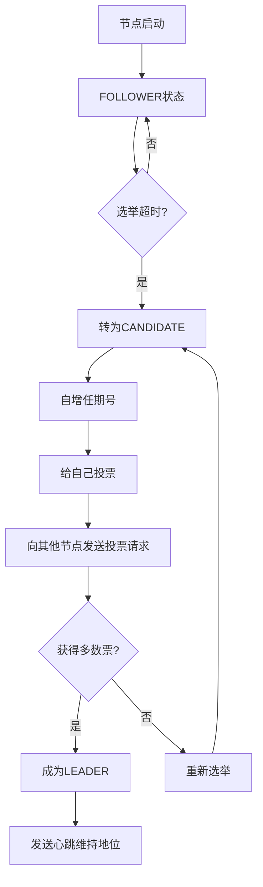
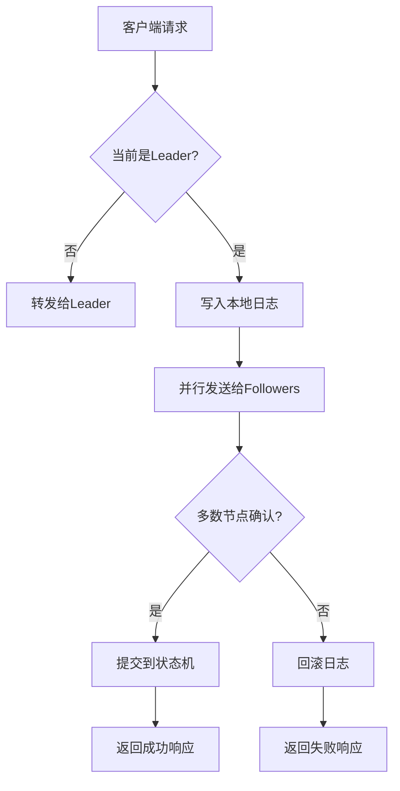

# Lu-Raft-KV 项目文档

## 项目概述

Lu-Raft-KV 是一个基于 Java 实现的 Raft 一致性算法的分布式键值存储系统。该项目严格按照 Raft 论文实现，主要用于学习和理解 Raft 一致性协议的核心机制。

### 核心特性

- **Leader 选举**：实现了完整的 Raft 领导者选举机制
- **日志复制**：实现了日志条目在集群中的复制和一致性保证
- **成员变更**：支持集群成员的动态添加和删除（已实现但未充分测试）
- **快照压缩**：暂未实现

## 项目架构

### 核心组件

#### 1. 节点管理 (Node)
- **Node 接口**：定义了节点的基本行为
- **DefaultNode 实现**：核心节点实现，管理节点的生命周期和状态转换

#### 2. 一致性模块 (Consensus)
- **Consensus 接口**：定义了一致性协议的核心方法
- **DefaultConsensus 实现**：实现了 Raft 的请求投票和附加日志 RPC

#### 3. 日志模块 (LogModule)
- **LogModule 接口**：定义日志存储和检索操作
- **DefaultLogModule 实现**：基于 RocksDB 的日志持久化实现

#### 4. 状态机 (StateMachine)
- **StateMachine 接口**：定义状态机的应用逻辑
- **DefaultStateMachine 实现**：基于 RocksDB 的键值存储状态机
- **RedisStateMachine 实现**：基于 Redis 的状态机实现

#### 5. RPC 通信
- **RpcService**：RPC 服务端实现
- **RpcClient**：RPC 客户端实现
- 基于 SOFA-Bolt 框架进行网络通信

### 节点状态

Raft 节点有三种状态：

1. **FOLLOWER (跟随者)**：默认状态，接收来自 Leader 的日志条目
2. **CANDIDATE (候选人)**：参与选举，尝试成为 Leader
3. **LEADER (领导者)**：处理客户端请求，管理日志复制

## 核心算法流程

### 1. Leader 选举流程



### 2. 日志复制流程



## 关键数据结构

### LogEntry (日志条目)
```java
public class LogEntry {
    private Long index;      // 日志索引
    private long term;       // 任期号
    private Command command; // 用户命令
}
```

### 节点持久化状态
- `currentTerm`：当前任期号
- `votedFor`：投票给哪个候选人
- `log[]`：日志条目数组

### 节点易变状态
- `commitIndex`：已提交的最大日志索引
- `lastApplied`：已应用到状态机的最大日志索引

### Leader 专用状态
- `nextIndex[]`：每个 follower 的下一个日志索引
- `matchIndex[]`：每个 follower 已复制的最大日志索引

## 启动和测试

### 1. 启动集群

在 IDEA 中配置 5 个启动项，分别设置不同的端口：

```
-DserverPort=8775
-DserverPort=8776  
-DserverPort=8777
-DserverPort=8778
-DserverPort=8779
```

### 2. 测试 Leader 选举

1. 依次启动 5 个节点
2. 观察控制台输出，约 6 秒后会发生选举
3. 关闭 Leader 节点，观察重新选举过程

### 3. 测试日志复制

使用命令行客户端进行测试：

```bash
# 启动客户端
java -cp target/classes raft.client.RaftClientWithCommandLine

# 执行命令
put key1 value1
get key1
put key2 value2
```

## 项目目录结构

```
lu-raft-kv/
├── src/main/java/cn/think/in/java/
│   ├── common/           # 通用组件
│   │   ├── NodeConfig.java    # 节点配置
│   │   ├── NodeStatus.java    # 节点状态定义
│   │   ├── Peer.java          # 节点信息
│   │   └── PeerSet.java       # 节点集合管理
│   ├── entity/           # 实体类
│   │   ├── LogEntry.java      # 日志条目
│   │   ├── Command.java       # 用户命令
│   │   ├── RvoteParam.java    # 投票请求参数
│   │   └── AentryParam.java   # 附加日志请求参数
│   ├── impl/             # 核心实现
│   │   ├── DefaultNode.java       # 默认节点实现
│   │   ├── DefaultConsensus.java  # 默认一致性实现
│   │   ├── DefaultLogModule.java  # 默认日志模块
│   │   └── DefaultStateMachine.java # 默认状态机
│   ├── rpc/              # RPC 通信
│   ├── current/          # 线程池管理
│   └── RaftNodeBootStrap.java # 启动类
└── src/main/java/raft/client/  # 客户端
    ├── RaftClientWithCommandLine.java # 命令行客户端
    └── RaftClientRPC.java       # RPC 客户端
```

## 技术栈

- **Java 8**：开发语言
- **RocksDB**：日志和状态机存储
- **SOFA-Bolt**：RPC 通信框架
- **FastJSON**：序列化框架
- **Lombok**：代码简化
- **SLF4J + Log4j**：日志框架

## 学习要点

### 1. Raft 协议核心概念
- **任期 (Term)**：逻辑时钟，用于检测过期的信息
- **日志一致性**：通过日志匹配确保数据一致性
- **安全性**：选举限制确保 Leader 包含所有已提交的日志

### 2. 关键实现细节
- **随机化选举超时**：避免选举冲突
- **日志冲突检测**：通过任期号和索引检测日志冲突
- **多数派确认**：确保数据安全性的核心机制

### 3. 性能优化
- **并行 RPC**：同时向多个节点发送请求
- **批量日志复制**：提高网络效率
- **异步处理**：避免阻塞主流程

## 注意事项

1. **数据一致性**：该项目优先保证数据一致性，性能相对较低
2. **网络分区**：在网络分区情况下，少数派节点无法提供服务
3. **成员变更**：成员变更功能已实现但测试不充分
4. **快照功能**：暂未实现，长时间运行可能导致日志过大

## 扩展建议

1. **实现快照功能**：定期压缩日志，减少存储空间
2. **优化网络通信**：使用更高效的序列化方案
3. **增加监控指标**：添加性能监控和健康检查
4. **完善测试用例**：增加更多的集成测试和压力测试

这个项目是学习 Raft 一致性算法的优秀示例，通过阅读和理解代码，可以深入掌握分布式一致性协议的核心原理和实现细节。

